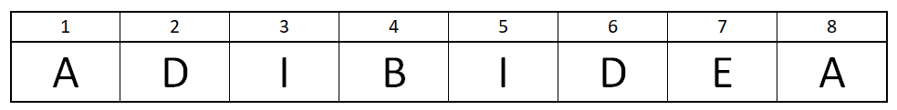

<p align="center">
    
</p>

Koaderno honetan, programazioko beste oinarrizko atal bat ikusiko da: **bektoreena**. 
# R-n Lehen Pausuak: Bektoreak
Bektoreak, dimentsio bakarreko aldagai zerrenda bezala uler daitezke. Aldagaiak, aurreko atalean ikusi bezala mota desberdinekoak izan daitezke. `R`-n bektore sinpleak sortzeko aukera bat `c()` funtzioa da (*combine*-etik datorrena).

`c()` funtzioa erabiltzen hasteko, hurrengo karaktere bektorea sortuko da:



```{r}
x <- c('A','D','I','B','I','D','E','A')

x
```

`c()` funtzioaren bidez, aldagaiak ere konbinatu daitezke:


```{r}
c(x,x)
```

Behin bektorea definitzen dugunean, bektorearen edozein elementu lortzeko aukera dugu. Horretarako `[]` karaktereak erabiliko ditugu:
 - Adibidez, `B` letra lortzea nahi badugu, `x` bektoreko 4. elementua, hurrengoa idatzi beharko dugu:


```{r}
x[4]
```

 - `E` letra lortzea nahi badugu aldiz, `x` bektoreko 7. elementuari deitu behar diogu:


```{r}
x[7]
```

Era berean, bektore numerikoak, bektore logikoak eta bektore mistoak defini ditzakegu, hurrengo kode blokean agertzen den bezala:


```{r}
y <- c(1,5,7,9)
z <- c(TRUE, T, F, FALSE)
A <- c(1, TRUE, "B", -90, FALSE, "Karaktere Katea")

y
z
A
```

Behin `y`, `z` eta `A` definiturik ditugula, aurreko kasuan bezala lor ditzazkegu elementuak:


```{r}
y[2]
z[4]
A[6]
A[1]
```

 - **Oharra:** *Konturatu `A` bektorearen balio guztiak karaktereetara eraldatu direla. `R`-k, bektoreko balio-motak desberdinak direnean, `c` funtzioaren bidez aldagai denak eraldatzen ditu mota berdinera. Kasu honetan karaktereetara, karaktereen bidez aldagai horiek guztiak adierazi baitaitezke.*


```{r}
class(A)
```

## Bektoreko elementuak eraldatzen
Orain arte, bektoreen elementuak aukeratzeko eta ikusteko modu bat azaldu da. Nola eraldatu ditzazkegu ordea bektore horiek? Demagun hurrengo bektorea dugula
$$(1,2,3,5,5,6)$$

eta 4. elementua eraldatzea nahi dugula, adibidez 4. elementuari 4 balioa ematea nahi diogula. Lehenik eta behin bektore hori definituko dugu:


```{r}
gaizki <- c(1,2,3,5,5,6)
```

Horretarako, hurrengo lerroa idatzi beharko dugu, hau da, 4. elementuari 4 balioa ematen diona.


```{r}
gaizki[4] <- 4

gaizki
```

Demagun orain, gure bektorean balio bat soberan dagoela, eta balio hori ezabatzea nahi dugula, gure adibiderako, hurrengo bektorea erabiliko dugu

$$\mbox{c('G','A','I','Z','Z','K','I')}$$

eta errepikatuta dagoen `Z` letra ezabatzea nahi dugula, hau da, 4. elementua (edo 5. elementua). Exekuta dezagun hurrengo kode blokea ea zer gertatzen den ikusteko.


```{r}
x <- c('G','A','I','Z','Z','K','I')

x[-1]

x[-3]

x[-4]

x[-6]
```

Beraz, `-` ikurraren bidez, gure bektoretik kanpo utziko dugu adierazitako elementua. Aldaketa hori gordetzea nahi baldin badugu, aldaketa hori aldagai berdinean edota beste aldagai baten gorde beharko dugu


```{r}
y <- x[-4]

y
```

## Bektoreen arteko eragiketak

Informazioa eta datuak aldagaietan gordetzea ondo dago, baina benetan interesgarriena datu horiekin lan egitea da, datuak eraldatzea gure nahien arabera. Bektore numerikoen kasuan, oinarrizko eragiketa matematikoak egin ditzazkegu:

$$(1,3,5)+(3,-2,5)=(1+3,3-2,5+5)=(4,1,10)$$

$$(1,3,5)-(3,-2,5)=(1-3,3+2,5-5)=(-2,5,0)$$


```{r}
bektorea_1 <- c(1,3,5)
bektorea_2 <- c(3,-2,5)

bektorea_1 + bektorea_2
bektorea_1 - bektorea_2
```

Bestalde, `R`-k era estandarrean ***elementuz elementuko*** biderketa eta zatiketa egiten du:

$$(1,3,5)\ast(3,-2,5)=(1\ast3,3\ast(-2),5\ast5)=(3,-6,25)$$

$$(1,3,5)/(3,-2,5)=(1/3,3/(-2),5/5)=(1/3,-3/2,1)$$


```{r}
bektorea_1 * bektorea_2
bektorea_1 / bektorea_2
```

Bektoreen arteko ***biderketa eskalarra*** egitea nahi baldin badugu `%*%` eragiketa erabili beharko dugu:

$$(1,3,5)\cdot(3,−2,5)=1∗3 + 3∗(−2) + 5∗5=3 - 6 + 25=22$$


```{r}
bektorea_1 %*% bektorea_2
```

### Birziklapen araua

Bektoreen arteko oinarrizko eragiketak ikusi ditugu eta orain eragiketa arau desberdin batzuk ikusiko ditugu. Zer gertatzen da `R`-n hurrengo eragiketa eginez gero? Errore bat jaurtiko al du?
$$(1,2,3)+1$$

Erantzun hori lortzeko, ondorengoa exektutatzearekin nahiko dugu:


```{r}
c(1,2,3) + 1

6 / c(1,2,3)
```

`R`-k, bektoreen arteko eragiketetan luzeera gutxien duen bektorearen elementuak **birziklatzen** edo **errepikatzen** ditu bi bektoreen luzeerak berdintzeko:

$$(1,2,3)+1:=(1,2,3)+(1,1,1)$$

$$6\ /\ (1,2,3):=(6,6,6)\ /\ (1,2,3):=(6/1,6/2,6/3)$$

Berdina gertatzen da luzeera desberdina duten beste kasuetan ere, **birziklapena** ematen da hurrengo eran:

$$(1,2,3,4,5,6)+(1,3):=(1,2,3,4,5,6)+(1,3,1,3,1,3)=(2,5,4,7,6,9)$$

$$(1,2,3,4,5,6,7,8,9)+(1,2,3):=(1,2,3,4,5,6,7,8,9)+(1,2,3,1,2,3,1,2,3)=(2,4,6,5,7,9,8,10,12)$$


```{r}
c(1,2,3,4,5,6) + c(1,3)

c(1,2,3,4,5,6,7,8,9) + c(1,2,3)
```

Aurreko kasuetan, bektoreen luzeerak proportzionalak ziren, lehenengo kasuan:

$$3=1\cdot3$$

eta beste bietan:

$$6=2\cdot3$$

$$9=3\cdot3$$

Azken bertsioetan, bektoreen luzeerak ez dira proportzionalak izan behar eragiketa egiteko, baina `R`-k `Warning` abisua emango du bi bektoreen luzeerak ez direla proportzionalak esanez.

$$(1,2,3,4,5) + (1,2) := (1,2,3,4,5)+(1,2,1,2,1)=(2,4,4,6,6)$$


```{r}
c(1,2,3,4,5) + c(1,2)
```

## `sum()`, `prod()`, `mean()` eta `sd()` funtzioak
Atal honetan 4 funtzio aztertuko ditugu, besteak beste bektore numerikoetan erabiltzen direnak: `sum()`, `prod()`, `mean()` eta `sd()`. Lehenengoak, bektorearen elementuen ***batuketa*** egiten du eta bigarrenak berriz elementuen arteko ***biderketa***


```{r}
x <- c(1,2,3,4)

sum(c(1,2,3,4))
sum(x)

prod(c(1,2,3,4))
prod(x)
```

`mean()` eta `sd()`-k aldiz, [media](https://eu.wikipedia.org/wiki/Batezbesteko_aritmetiko_sinple) eta [desbiderapen estandarra](https://eu.wikipedia.org/wiki/Desbideratze_estandar) (standard deviation) kalkulatzen dute:


```{r}
mean(x)

sd(x)
```

### Segida aritmetikoak sortzen

Segida aritmetikoak, hurrengo itxura duten zenbaki segidak dira:

$$a_n = a_{n-1} + d$$
non $d$ zenbaki finko bat den. Adibidez:

$$1,2,3,4,5,...,100$$

$$2,4,6,8,10,...,270$$

$$20,18,16,14,12,...,0$$

$d=1$ den kasuetarako, `:` erabili daiteke


```{r}
1:20

5:17

3:-10
```

$d\neq1$ den kasuetarako `seq()` funtzioa existitzen da. Funtzioaren barruan, argumentu bezala hurrengoak erabiliko ditugu:
 - `from`: segidaren ***lehen*** zenbakia
 - `to`: segidaren ***azken*** zenbakia
 - `by`: segida aritmetikoaren $d$ balioa


```{r}
seq(from = 10, to = 20, by = 2)

seq(from = 3, to = -15, by = -3)
```

## Bektoreen elementu anitzen aukeraketa
Koaderno honen hasieran, bektoreen elementuei nola deitu azaldu da, baina elementu bakar bati. Oraingoan, kasu hori orokortuko da elementu bati baino gehiagori deitzeko


```{r}
x <- 1:100

#x bektorearen 2,6 eta 7. elementuak lortuko ditugu
x[c(2,6,7)]

#x bektorearen 77,78,79 eta 80. elementuak lortuko ditugu
x[77:80]

#x bektoretik 2, 6 eta 7. elementuak kenduko ditugu
x[-c(2,6,7)]

#x bektorearen 99,96,93 eta 90. elementuak lortuko ditugu
x[seq(from = 99, to = 90, by = -3)]
```

## Bektoreen elementuei izenak ematen

Bektoreko elementuei posizioaren arabera deitu beharrean izenaren bidez deitzea nahi baldin badugu, `names()` funtzioa erabiliko dugu. Suposa dezagun `urteak` bektorean gurasoen eta anai-arreben jaiotze-data gordetzea nahi dugula hurrengo eran ordenaturik:
 - Aita
 - Ama
 - Anaia
 - Arreba


```{r}
urteak <- c(1950,1949,1985,1988)
```

Sartutako datuen ordena ahizteko arazoa dugunez, `names()` funtzioa erabiliko dugu:


```{r}
names(urteak) <- c("Aita", "Ama", "Anaia", "Arreba")

urteak
```

Beraz, behin bektoreari izenak definitu eta gero izen horien bidez lor daitezke nahi ditugun balioak, kasu honetan jaiotze-data:


```{r}
urteak["Aita"]

urteak[c("Ama","Arreba")]
```

 - **Oharra:** *`names()` funtzioaren bidez edozein aldagai mota esleitzen dugula ere, era automatikoan karaktereetara bihurtuko du*


```{r}
x <- 21:30

names(x) <- 1:10

x

x["1"]
```

## `length` funtzioa
Bektoreei oso loturik doan funtzio bat `length` funtzioa da. Funtzio honek, ingelesezko hitzak dioen bezala luzeera kalkulatzen du, hau da, bektorearen elementu kopurua:


```{r}
length(c(1,2,5,10,5,2,1))

length(c(8:1006))
```

### Ariketak:


```{r}
#Gorde 'x' aldagaian (1,5,9,13,17,21,25,29,33,37,41,45) bektorea


#Kalkulatu 'x' bektoreko elementuen batura


#Kalkulatu 'x' bektorearen luzeera (elementu kopurua)


#Aukeratu 'x' bektoreko 4. eta 7. elementuak


```

# Erabilitako funtzio berriak:
 - `c`
 - `sum`
 - `prod`
 - `mean`
 - `sd`
 - `seq`
 - `names`
 - `length`
