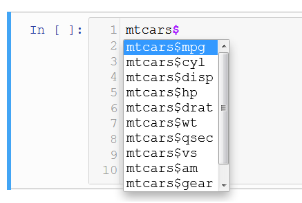
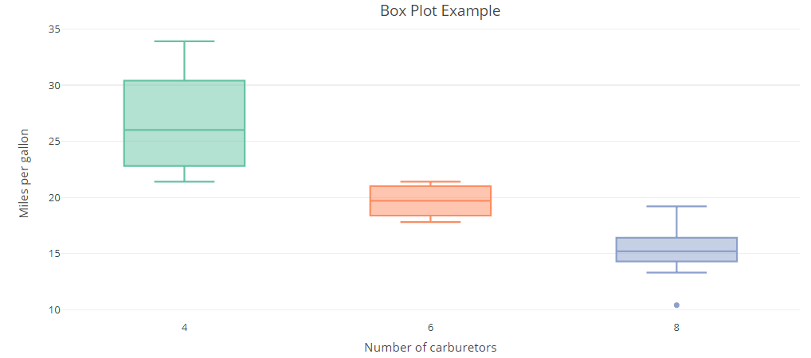

<p align="center">

</p>

# Data Frame-ak

Kurtso honen hasieran esan bezala, `R` estatistikara eta grafikoetara bideratutiko programazio-lengoaia da eta horretarako, argi dagoen bezala datuak behar dira. Aldi berean, datuak forma eta mota askotakoak izan daitezke eta ahal den neurrian datu horiek egituratzea eta ordenatzea oso interesgarria izango da analisirako. Hor sartzen dira jokoan hain zuzen ere **Data Frame**-ak.

**Data Frame**-ak, datu taulak dira, matrize egitura dutelarik. Seguraski, gaur egun taulak sortzeko erabiltzen den programarik ezagunenetakoena **Microsoft Excel** izango da. Bertan gauza desberdin asko egin daitezkeen arren, programaren funtsa taulekin lana egitea da.

Esan bezala, **Data Frame**-ak matrize itxurako taulak dira, baina askoz moldagarriagoak eta eraginkorragoak kasu askotan. **Data Frame**-etan, zutabe bakoitzak formatu ezberdin bat izan dezake (karaktere-kateak, zenbakiak, aldagai logikoak, faktoreak...) eta matrizeetan hori ez da posible.

Sarrera honen ondoren, has gaitezen adibide bat ikusten.

 - **OHAR GARRANTZITSUA:** *Data Frame-ak, `R`-n taulak sortzeko era estandarra eta oinarrizkoa da, baina hala ere azkarragoa eta eraginkorragoa den beste bat existitzen da: **Data Table**-a. Data Table-ak hurrengo koadernoan azaltzen dira eta sintaxi aldetik desberdintasunak daude. Funtsean biak dira Data Frame-ak, baina esan bezala sintaxi ezberdina dute eta Data Table-ak eraginkorragoak dira orokorrean.*
 
 *Beraz, irakurleak hurrengo galdera egin dezake: zein ikastea da gomendagarriagoa? Galdera honek ez du erantzun zehatzik, baina nire gomendioa biak ikastea da. Hala ere, blog eta diskusio askotan bietako bat ikastekotan **Data Table**-ak ikastea gomendatzen da orokorrean, aurretik aipatutako arrazoiengatik.*
 
 >- [data.table vs. data.frame](https://www.analyticsvidhya.com/blog/2016/05/data-table-data-frame-work-large-data-sets/)
 >- [What is the practical difference between data.frame and data.table in R](https://stackoverflow.com/questions/18001120/what-is-the-practical-difference-between-data-frame-and-data-table-in-r)
 
Ohar horren ondoren, **Data Frame**-ekin hasiko gara. Horretarako, `R`-k berez dakarren `mtcars` taula erabiliko dugu.


```{r}
mtcars
```

Orokorrean, oso garrantzitsua izaten da hurrengo egitura mantentzea Data Frame-etan:

 - Zutabeetan ***aldagaiak***
 - Errenkadetan ***elementuak***
 
Adibide honetan, ***aldagaiak***:

 - `mpg`, `cyl`, `disp`, `hp`, `drat`, `wt`, `qsec`, `vs`, `am`, `gear` eta `carb` dira.
 
eta ***elementuak*** berriz kotxe markak:

 - Mazda RX4, Mazda RX4 Wag, Datsun 710...
 
Aldagai bakoitzak bere esanahia du, adibidez `mpg` gasolina kontsumoa da (*miles per gallon*), `hp` zaldi-potentzia da (*horsepower*) eta `cyl` zilindro kopurua (*cylinders*). Taula horren informazio gehiago lortzeko hurrengo lerroa exekuta dezakegu:


```{r}
?mtcars
```

Taulen hasierako ideia bat egiteko, hurrengo 5 funtzioak erabili ditzazkegu besteak beste:

 - `dim`: taularen dimentsioak ezagutzeko (elementu eta aldagai kopurua)
 - `names`: aldagaiak ezagutzeko
 - `summary`: taulako aldagai bakoitzaren laburpen bat egiten du, oinarrizko datu estatistiko batzuk emanez.
 - `head` / `tail`: hasierako/amaierako elementuak erakusteko
 - `str`: taularen egitura azaltzen du (dimentsioa, aldagaiak eta aldagai motak)


```{r}
dim(mtcars)
```


```{r}
names(mtcars)
```


```{r}
summary(mtcars)
```


```{r}
head(mtcars)
```


```{r}
str(mtcars)
```

Azter daitekeen bezala, funtzio batzuk informazio berdina edo antzekoa ematen dute, baina beharren eta kasuaren arabera horietako bat edo beste erabili daiteke. Adibide honetatik hurrengo informazioa atera daiteke:

 - 32 elementu
 - 11 aldagai
 - Aldagai guztiak zenbakizkoak (`num`)

## Zutabeak, errenkadak eta elementuak aukeratzen

Data Frame-etako elementuak, matrizeetako elementuen era berdinean lor daitezke, hau da, `[]` erabiliz:


```{r}
#1. zutabea
mtcars[,1]
```


```{r}
#20. errenkada
mtcars[20,]
```


```{r}
#'Datsun 710' kotxearen zaldi-potentzia ('hp')
mtcars["Datsun 710","hp"]
```

Bestalde, zutabeak lortzeko beste bi metodo daude:

 - `[[]]`
 - `$` (Honetarako zutabeek izena izan behar dute)


```{r}
#5. zutabea
mtcars[[5]]
```


```{r}
#'drat' zutabea
mtcars[["drat"]]
```


```{r}
#'mpg' zutabea
mtcars$mpg
```

`$` metodoa oso erabilgarria izaten da balio zehatz bat duten elementuak aukeratzeko orduan, adibidez:


```{r}
#'cyl' aldagaian 6 zenbakia duten elementuak
mtcars[mtcars$cyl == 6,]
```


```{r}
#'cyl' aldagaian 6 zenbakia eta 'hp' aldagaian 110 duten elementuak
mtcars[mtcars$cyl == 6 & mtcars$hp == 110,]
```


```{r}
#'cyl' aldagaian 6 zenbakia eta 'hp' aldagaian 110 duten elementuak
#Erakutsi 'wt' eta 'drat' aldagaiak bakarrik
mtcars[mtcars$cyl == 6 & mtcars$hp == 110, c("wt","drat")]
```

 - **Oharra:** `mtcars$` idatzi ondoren TABULAZIO (`Tab`) botoia sakatu ezkero, erabilgarri dauden aldagaien lista agertuko da.
 
<p align="center">

</p>

Data Frame-ean zutabe multzo batekin geratzea nahi baldin bada `subset` funtzioa erabili daiteke:


```{r}
df <- subset(mtcars, select = c(mpg, cyl, am))

head(df)
```

Taulatik zutabe multzo bat ezabatzea nahi izanez gero aldiz `subset` erabiltzerakoan, `select`-en partean `-` ikurra erabiliko dugu:


```{r}
df <- subset(mtcars, select = -c(mpg, cyl, am))

head(df)
```

**Oharra:** *Konturatu hurrengo kasuak desberdinak direla*


```{r}
#Metodo hauen bidez BEKTORE bat sortzen da
class(mtcars$mpg)
mtcars$mpg
#mtcars[["mpg"]]
#mtcars[,"mpg"]
```


```{r}
#Metodo honen bidez DATA.FRAME bat sortzen da
class(mtcars["mpg"])
mtcars["mpg"]
```

## Faktoreak

Koaderno honen hasieran esan bezala, Data Frame-en bidez zutabe bakoitza aldagai-mota ezberdinekoa izan daiteke. `mtcars`-en kasuan, ikusi den bezala zutabe guztiak zenbakizkoak edo numerikoak (`num`) dira, hala ere aldaketa batzuk egingo ditugu aurrerago.

Azpi-atal honetan, **faktoreekin** sartuko gara, tauletan garrantzi berezia duten aldagai-mota. **Faktoreek** aukera finitu jakin bat eskaintzen dute eta aukera horietara mugatzen dira. Demagun adibidez inkesta batean azken astean telebista ikusi den edo ez galdetzen dela. Erantzun posibleak 2 dira:

 - BAI
 - EZ
 
Kasu horretan aldagai hori faktore dikotomiko (2 aukera bakarrik eskaintzen dituelako) bezala adierazi daiteke, hau da, **aldagai horretako elementu guztiak** 2 aukera horietan bakarrik sailkatu daitezke, ez da hortik kanpora beste aukera posiblerik egongo. Hala ere, faktoreak ez dira 2 aukeratara mugatzen (dikotomikoak), demagun beste inkesta baten pelikula baten puntuazioa eskatzen dela eta baloratzeko balio posibleak 1,2,3,4 edo 5 direla. Kasu hori ere faktore bidez adierazteko aukera egongo zen, aukera posibleak ezagunak eta finituak (mugatuak) direlako.

Hori horrela izanik, `mtcars` taulan ze aldagai kontsidera genezake faktoreetara pasatzeko egokiak? Data Frame-aren informazioa irakurtzen baldin badugu, hurrengo aldagaiak faktoreetara pasatzeko oso aproposak dira:

 - `vs`: V (motorra 'V' eran) edo S (motorra linean, *straight*)
 - `am`: A (martxa automatikoak) edo M (eskuzko martxak)

Horietaz gain, beste 3 aldagai ere faktoreetara pasako ditugu:

 - `cyl`: zilindro kopurua (4,6 edo 8)
 - `gear`: martxa kopurua (3,4 edo 5)
 - `carb`: karburagailu kopurua (1,2,3,4,6 edo 8)

*(Kontuz ibili behar da kasu hauetan zeren eta taulan elementu berriren bat sartzen baldin badugu, balio horietatik kanpo dagoen bat ager daiteke eta ondorioz errore bat jaurtiko digu `R`-k, hala ere hasierako analisi honetarako ez dugu hori kontutan izango)*

Bihur ditzagun bada 5 aldagai horiek faktoreetan `factor` funtzioaren bidez


```{r}
df <- mtcars

for (i in c("vs","am","cyl","gear","carb")){
    df[[i]] <- factor(df[[i]])
}
```

Bisualki, datuak ez dira aldatzen


```{r}
head(df)
```

Baina `R`-k datuak era ezberdinean kontsideratzen ditu, ikus dezagun bestela `summary` funtzioa:


```{r}
summary(df)
```

Oraingoan faktore bilakatu ditugun aldagaiak desberdin ikusten dira. `cyl` aldagaian jartzen baldin badugu arreta, honako hau adieratzen digu:

 - `cyl` aldagaian `4` balioa duten 11 elementu daude.
 - `cyl` aldagaian `6` balioa duten 7 elementu daude.
 - `cyl` aldagaian `8` balioa duten 14 elementu daude.

Eskaintzen digun informazioa, lehen eskaintzen ziguna baino dezente interesgarriagoa eta zehatzagoa da. `str`-ren bidez lortzen dugun informazioa ere aldatu egiten da.


```{r}
str(df)
```

### Abantailak

Esan bezala, faktoreak, aldagai kategorikoak sortzeko balio dute eta horren bidez `R`-k kategoria edo taldeak desberdintzen ditu. Horren bidez, **GRAFIKOAK** egiterako orduan taldeka marraz ditzakegu era errazago baten. Hurrengo irudian adibidez, 3 [kaxa-diagrama](https://eu.wikipedia.org/wiki/Kaxa-diagrama) marraztu dira karburagailu kantitate bakoitzeko. Talde bakoitzeko kotxeek duten autonomia ikusteko:

<p align="center">

</p>

Bestalde, hainbat analisi estatistikorako ere oso garrantzitsuak izaten dira, besteak beste ***erregresio linealetarako.***

### Desabantailak

Sor ditzakeen desabantailak hurrengoak dira besteak beste:

 - Taulak espazio gehiago behar du informazio hori gordetzeko
 - Prozesaketan denbora gehiago behar izaten du
 - Faktore horietatik kanpo dagoen balioren bat sartzean errorea ematen du

## Zutabeak aldatzen eta sortzen

Azpi-atal honetan zutabeen eraldaketak aztertuko ditugu. Konturatzen baldin bagara, ikusi dugu iada zutabeen aldaketa bat, aldagai bat faktore bilakatzekoa hain zuzen ere. Orokorrean, eraldaketak era berean egiten dira.


```{r}
df <- mtcars

#Kotxe guztiak automatiko bihurtuko ditugu
df$am <- 1

df$am
```

Alda dezagun orain 0 eta 1 aldagai dikotomikoa "Eskuzko" eta "Automatiko"-ra


```{r}
df <- mtcars

#'am' aldagaian 0 balio dutenei "Eskuzkoa" eta 1 balioa dutenei "Automatikoa"
df[df$am == 0,"am"] <- "Eskuzkoa"
df[df$am == 1,"am"] <- "Automatikoa"

head(df)
```

Zutabe berria sortzeko, izena eta eman nahi zaion balioa bakarrik zehaztu behar dugu:


```{r}
df <- mtcars

#'bat' zutabea sortzen 1 balioekin
df$bat <- 1      #Beste era bat df[["bat"]] <- 1

#'mpg_bider10' aldagaia sortzen 'mpg' aldagaia 10 zenbakiarekin bidertuz
df$mpg_bider10 <- df$mpg * 10

head(df)
```

Matrizeen atalean ikusitako `cbind` eta `rbind` funtzioak ere erabili daitezke tauleri zutabeak eta errenkadak atxikitzeko hurrenez hurren.

## Taulak zutabeka ordenatzen

Taulak zutabearen arabera nola ordenatu ikusiko dugu `order` funtzioaren bidez, horretarako, lehendabizi `order` funtzioa bektoreetan probatuko dugu:


```{r}
x <- c(1,4,6,347,13,4,134,123,3)

order(x)
```

Lortutako emaitza arraro samarra egin daiteke, baina azaldutakoan erraz ulertzen da:

 - 1 . elementua `a` bektoreko 1. elementua da: 1
 - 2 . elementua `a` bektoreko 9. elementua da: 3
 - 3 . elementua `a` bektoreko 2. elementua da: 4
 - 4 . elementua `a` bektoreko 6. elementua da: 4
 - ...
 - 9 . elementua `a` bektoreko 4. elementua da: 347
 
Beraz, balio horiek `a` bektoreari aplikatuz gero, nahi dena lortuko da:


```{r}
x <- c(1,4,6,347,13,4,134,123,3)

x[order(x)]
```

Era berean ordenatzen ditu karaktere-kateak ere:


```{r}
x <- c("Euria","Elurra","E","Eskua","Geruza", "Gerezi")

x[order(x)]
```

Hori horrela dela ikusirik, emaitza horiek tauletara pasatzea falta zaigu:


```{r}
df <- mtcars

#'mpg' aldagaiaren arabera ordenatuko dugu
df <- df[order(mtcars$mpg),]
head(df)
```

Ordenatzeko era aldatzea nahi baldin badugu, hau da, handitik txikira `order(..., decreasing = TRUE)` erabili beharko da


```{r}
df <- mtcars

#'mpg' aldagaiaren arabera ordenatuko dugu
df <- df[order(mtcars$mpg, decreasing = TRUE),]
head(df)
```

## Data Frame-ak sortzen eta inportatzen
Amaitzeko, Data Frame-ak nola sortu eta inportatu ikusiko da. Arraroa baldin badirudi ere atal hau koadernoaren amaieran aurkitzea, kasu honetan garrantzia gehiago eman zaio taulen erabilerari. Data Frame-ak sortzeko, `data.frame` funtzioa erabiliko dugu. Funtzio horrek aukera ezberdin ugari ditu, baina oraingo hontan era sinpleenetarikoena aztertuko da:


```{r}
data.frame("Aldagaia1" = 1:3, "Aldagaia2" = 3:1, "Aldagaia3" = c("A","B","C"))
```

Azter daitekeen bezala, taulen zatirik funtsezkoena aldagaiei ***izenak*** eta ***balioak*** ematea da. ***Izenak*** ezkerreko aldean jartzen dira `""` komatxo artean eta ***balioak*** `=` ikurraren ondoren.


```{r}
data.frame("Urtea" = 2018, "Hilabetea" = c("Urtarrila", "Otsaila", "Martxoa"), "Egun_kopurua" = c(31,28,31))
```

Bestalde, datuak inportatzeko garaian, datuak ze formatutan gordeta dauden jakin beharko da: 
 - xls, txt, csv...
 
Hemen, *csv* (*comma separated values*) formatuko datuak nola inportatu aztertuko da. Horretarako, `R`-k berez dakarren `read.csv` funtzioa erabili daiteke.


```{r}
df <- read.csv("adibide.csv")
class(df)
df
```

## Ariketak:
`R`-k berez dakarren beste taula bat `airquality` da, gogoratu taula horren inguruko informazio gehiago izateko hurrengo lerroa exekutatu daitekeela.


```{r}
?airquality
```

`airquality` taula `df` aldagaian gordeko dugu eta ariketak eta egin beharreko aldaketak `df` Data Frame-ean egingo dira


```{r}
df <- airquality
```

Taula horrekin, hurrengo ariketak proposatzen dira:


```{r}
#Kalkulatu taularen DIMENTSIOAK (elementu kopurua eta aldagai kopurua)


#Egin taularen LABURPEN (summary) taula bat datuen nondik norakoa ezagutzeko


```


```{r}
#Zenbat egunetan izan ziren 80Fº baino gehiago?


```

Sortu `Temp_Celsius` aldagai berria tenperatura Cº-tan gordetzen duena, Fº izan beharrean (taulan Fº-tan ageri da). Fahrenheit-Celsius aldaketaren formula hurrengoa dela jakinik:

$$Celsius = \dfrac{Fahrenheit - 32}{1.8}$$


```{r}
#Sortu 'Temp_Celsius' aldagai berria 'Temp' aldagaia Cº-tan gordetzen duena


```

# Erabilitako funtzio berriak:

 - `summary`
 - `head`
 - `tail`
 - `str`
 - `subset`
 - `factor`
 - `order`
 - `data.frame`
 - `read.csv`
