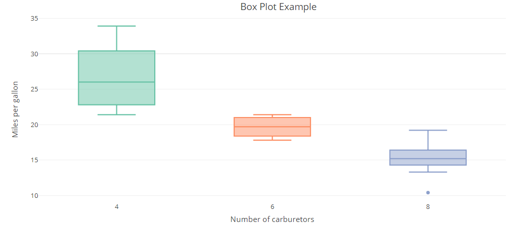

<p align="center">

</p>

# Data Table-ak

(*Data Table-en inguruko informazio eta gidak: [data.table](https://github.com/Rdatatable/data.table/wiki/Getting-started)*)

Aurreko atalean esan bezala, Data Table-ak, Data Frame-ak bezala datu-taulak dira funtsean. Sintaxi desberdina dute biek eta orokorrean Data Table-ak eraginkorragoak dira. Hala ere, ez da `R`-ren berezko funtzio bat eta ondorioz instalatu egin beharko da. 

***Koaderno hauek Binder bidez (online) jarraitzen ari direnek ez dute ezer ere ez instalatu behar.***

Instalatzeko, aukera errazena hurrengo kodea exekutatzea da, `#` karakterea ezabatuz:


```{r}
#install.packages("data.table")
```

Hala ere, zenbait kasutan Jupyter bidez paketeak instalatzea ez da posible izango eta ondorioz `R`-ko saio bat ireki beharko da eta kode berdina exekutatu:

`install.packages("data.table")`

Normalean instalaziorako zerbitzari bat aukeratu beharko da (nahi dena aukeratu daiteke) eta aukeratutakoan instalatzen hasiko da.

<p align="center">

</p>

Behin instalatuta baldin badugu, hurrengo kode lerroa exekutatuko dugu `data.table` paketea kargatzeko.

*(Koaderno honetako atal asko Data Frame-eko berdinak dira, bien arteko antzekotasunak eta ezberdintasunak aztertzeko asmoarekin. Data Table-ak orokorrean malgutasun handiagoa dute eta efizienteagoak dira. Hala ere, malgutasun hori eskaintzeak kodea zaildu dezake edota jakintza maila altuagoa eskatzen du hainbat gauzatarako.)*


```{r}
library("data.table")
```

**Oharra:** *Ondo instalatu baldin badugu, aurreko lerroak ez du inongo errorerik eman behar, baina `Warning` bat itzul dezake `R`-ren bertsioari buruz. Hala ere, `Warning` horrek ez luke garrantzia handiegirik izan beharko momentuz.*

Hasteko, `R`-k dakarren `mtcars` Data Frame-a, Data Table-ean bihurtuko dugu `data.table` edo `as.data.table` funtzioen bidez


```{r}
DT <- data.table(mtcars)
#DT <- as.data.table(mtcars)

DT
```

`class` funtzioa erabiltzen baldin badugu, Data Table-a, bere barnean Data Frame bat dela ikus dezakegu (edota horren hobekuntza bat).


```{r}
class(DT)
```

Aurreko atalean esan bezala, orokorrean oso garrantzitsua izaten da hurrengo egitura mantentzea Data Table-etan:

 - Zutabeetan aldagaiak
 - Errenkadetan elementuak
 
Adibide honetan, ***aldagaiak***:

 - `mpg`, `cyl`, `disp`, `hp`, `drat`, `wt`, `qsec`, `vs`, `am`, `gear` eta `carb` dira.
 
eta ***elementuak*** berriz kotxe markak:

 - Mazda RX4, Mazda RX4 Wag, Datsun 710...
 
Aldagai bakoitzak bere esanahia du, adibidez `mpg` gasolina kontsumoa da (*miles per gallon*), `hp` zaldi-potentzia da (*horsepower*) eta `cyl` zilindro kopurua (*cylinders*). Taula horren informazio gehiago lortzeko hurrengo lerroa exekuta dezakegu:


```{r}
?mtcars
```

Taulen hasierako ideia bat egiteko, hurrengo 5 funtzioak erabili ditzakegu besteak beste:

 - `dim`: taularen dimentsioak ezagutzeko (elementu eta aldagai kopurua)
 - `names`: aldagaiak ezagutzeko
 - `summary`: taulako aldagai bakoitzaren laburpen bat egiten du, oinarrizko datu estatistiko batzuk emanez.
 - `head` / `tail`: hasierako/amaierako elementuak erakusteko
 - `str`: taularen egitura azaltzen du (dimentsioa, aldagaiak eta aldagai motak)


```{r}
dim(DT)
```


```{r}
names(DT)
```


```{r}
summary(DT)
```


```{r}
head(DT)
```


```{r}
str(DT)
```

Azter daitekeen bezala, funtzio batzuk informazio berdina edo antzekoa ematen dute, baina beharren eta kasuaren arabera horietako bat edo beste erabili daiteke. Adibide honetatik hurrengo informazioa atera daiteke:

 - 32 elementu
 - 11 aldagai
 - Aldagai guztiak zenbakizkoak (`num`)
 
**Oharra:** *Data Table-ak EZ dituzte errenkaden izenak gordetzen, Data Frame-ak ez bezala. Beraz, errenkaden izenak mantentzea edo gordetzea nahi baldin bada Data Table batean, errazena zutabe bat sortzea da izen horiek gordetzeko.*


```{r}
DT <- cbind(Izena = row.names(mtcars), data.table(mtcars))
DT
```

## Zutabeak, errenkadak eta elementuak aukeratzen

Data Table-etako elementuak, matrizeetako elementuen era berdinean lor daitezke, hau da, `[]` erabiliz:


```{r}
#1. zutabea
DT[,1]

#1. eta 3. zutabea
#DT[,c(1,3)]
```


```{r}
#20. errenkada
DT[20,]

#2. eta 20. errenkada
#DT[c(2,20)]
```

Bestalde, zutabeak lortzeko beste bi metodo daude:

 - `[[]]`
 - `$` (Honetarako zutabeek izena izan behar dute)


```{r}
#5. zutabea
DT[[5]]
```


```{r}
#'drat' zutabea
DT[["drat"]]
```


```{r}
#'mpg' zutabea
DT$mpg
```

`data.table`-en kasuan, taula barnean aldagaiak zehazteko orduan ez da `""` edota `$` erabili behar, `data.frame`-etan ez bezala.


```{r}
#'cyl' aldagaian 6 zenbakia duten elementuak
DT[cyl == 6,]

#DATA FRAME
#mtcars[mtcars$cyl == 6,]
#mtcars[mtcars[["cyl"]] == 6,]
```


```{r}
#'cyl' aldagaian 6 zenbakia eta 'hp' aldagaian 110 duten elementuak
DT[cyl == 6 & hp == 110,]

#DATA FRAME
#mtcars[mtcars$cyl == 6 & mtcars$hp == 110,]
#mtcars[mtcars[["cyl"]] == 6 & mtcars[["hp"]] == 110,]
```

Beraz, esan daiteke sintaxi aldetik `data.table`-ak *garbiagoak* direla.

 - **Oharra:** `DT$` idatzi ondoren TABULAZIO (`Tab`) botoia sakatu ezkero, erabilgarri dauden aldagaien lista agertuko da.
 
<p align="center">

</p>

Data Table-ean zutabe multzo batekin geratzea nahi baldin bada, aukera bat honakoa da:


```{r}
DT[, .(mpg, cyl, am)]

#edo
#DT[, c("mpg", "cyl", "am")]
```

Data Table-ak, esan bezala beraien sintaxi propioa dute. Horren adibide da hurrengo kode-lerroa:


```{r}
DT[,.SD,.SDcols = c("mpg","cyl","am")]
```

Kasu honetan, aurreko gauza berdina egiten ari gara, nahi diren zutabeak aukeratzen. Horretarako, Data Table-etan `.SD` eta `.SDcols` existitzen dira. `.SD`-k, *Subset Data* esan nahi du, hau da, datuen azpi-taula bat eratzeko balio du eta aukeratzea nahi diren zutabeak `.SDcols`-en definitzen dira. Aurrerago ikusiko da `.SD` eta `.SDcols`-en erabilera praktiko bat.

Taulatik zutabe multzo bat ezabatzea nahi izanez gero aldiz:


```{r}
DT[,-c("mpg", "cyl", "am")]

#edo
#DT[,.SD,.SDcols = -c("mpg","cyl","am")]
```

**Oharra:** *Konturatu hurrengo kasuak desberdinak direla*


```{r}
#Metodo hauen bidez BEKTORE bat sortzen da
class(DT$mpg)
DT$mpg

#DT[["mpg"]]
#DT[,mpg]
```


```{r}
#Metodo honen bidez DATA.FRAME bat sortzen da
class(DT[,.(Izena)])
DT[,.(Izena)]

#DT[,c("Izena")]
#DT[,1]
#DT[,.SD,.SDcols = c("Izena")]
```

## Faktoreak

Koaderno honen hasieran esan bezala, Data Frame-en bidez zutabe bakoitza aldagai-mota ezberdinekoa izan daiteke. `mtcars`-en kasuan, ikusi den bezala zutabe guztiak zenbakizkoak edo numerikoak (`num`) dira, hala ere aldaketa batzuk egingo ditugu aurrerago.

Azpi-atal honetan, **faktoreekin** sartuko gara, tauletan garrantzi berezia duten aldagai-mota. **Faktoreek** aukera finitu jakin bat eskaintzen dute eta aukera horietara mugatzen dira. Demagun adibidez inkesta batean azken astean telebista ikusi den edo ez galdetzen dela. Erantzun posibleak 2 dira:

 - BAI
 - EZ
 
Kasu horretan aldagai hori faktore dikotomiko (2 aukera bakarrik eskaintzen dituelako) bezala adierazi daiteke, hau da, **aldagai horretako elementu guztiak** 2 aukera horietan bakarrik sailkatu daitezke, ez da hortik kanpora beste aukera posiblerik egongo. Hala ere, faktoreak ez dira 2 aukeratara mugatzen (dikotomikoak), demagun beste inkesta baten pelikula baten puntuazioa eskatzen dela eta baloratzeko balio posibleak 1,2,3,4 edo 5 direla. Kasu hori ere faktore bidez adierazteko aukera egongo zen, aukera posibleak ezagunak eta finituak (mugatuak) direlako.

Hori horrela izanik, `mtcars` taulan ze aldagai kontsidera genezake faktoreetara pasatzeko egokiak? Data Frame-aren informazioa irakurtzen baldin badugu, hurrengo aldagaiak faktoreetara pasatzeko oso aproposak dira:

 - `vs`: V (motorra 'V' eran) edo S (motorra linean, *straight*)
 - `am`: A (martxa automatikoak) edo M (eskuzko martxak)

Horietaz gain, beste 3 aldagai ere faktoreetara pasako ditugu:

 - `cyl`: zilindro kopurua (4,6 edo 8)
 - `gear`: martxa kopurua (3,4 edo 5)
 - `carb`: karburagailu kopurua (1,2,3,4,6 edo 8)

*(Kontuz ibili behar da kasu hauetan zeren eta taulan elementu berriren bat sartzen baldin badugu, balio horietatik kanpo dagoen bat ager daiteke eta ondorioz errore bat jaurtiko digu `R`-k, hala ere hasierako analisi honetarako ez dugu hori kontutan izango)*

Bihur ditzagun bada 5 aldagai horiek faktoreetan `factor` funtzioaren bidez


```{r}
zutabeak <- c("vs","am","cyl","gear","carb")
DT[,(zutabeak) := lapply(.SD, factor), .SDcols = zutabeak]
```

Goiko 2 lerroetan hurrengoa egin dugu:

 - Alde batetik, faktoreetara pasatzea nahi ditugun aldagaiak `zutabeak` bektorean gorde.
 - Bestetik, aldagai horiei `factor` funtzioa aplikatu zaie (`lapply`) zehaztutako zutabeetan `.SDcols`.

Data Table-etan hori da zutabeen aldagai mota aukeratzeko era naturalenetako bat, baina hala ere, Data Frame-etako egitura jarraituz, kasu honetan ere `for` baten bidez defini ditzakegu faktoreak:


```{r}
for (i in c("vs","am","cyl","gear","carb")){
    DT[,(i) := factor(get(i))]
}
```

**Oharra:** *`get` funtzioaren bidez, `i` aldagaian gordeta dagoen balioa hartzen da zutabe bezala (`"vs","am","cyl","gear","carb"`). Bestela, Data Table-a `i` izeneko zutabea bilatzen jarriko zen eta kasu honetan ez da existitzen. Antzeko zerbait gertatzen da `(i)`-rekin, parentesirik gabe jarri ezkero `i` izeneko zutabea bilatzen hasiko zen.*

Bisualki, datuak ez dira aldatzen


```{r}
head(DT)
```

Baina `R`-k datuak era ezberdinean kontsideratzen ditu, ikus dezagun bestela `summary` funtzioa:


```{r}
summary(DT)
```

Oraingoan faktore bilakatu ditugun aldagaiak desberdin ikusten dira. `cyl` aldagaian jartzen baldin badugu arreta, honako hau adieratzen digu:

 - `cyl` aldagaian `4` balioa duten 11 elementu daude.
 - `cyl` aldagaian `6` balioa duten 7 elementu daude.
 - `cyl` aldagaian `8` balioa duten 14 elementu daude.

Eskaintzen digun informazioa, lehen eskaintzen ziguna baino dezente interesgarriagoa eta zehatzagoa da. `str`-ren bidez lortzen dugun informazioa ere aldatu egiten da.


```{r}
str(DT)
```

### Abantailak

Esan bezala, faktoreak, aldagai kategorikoak sortzeko balio dute eta horren bidez `R`-k kategoria edo taldeak desberdintzen ditu. Horren bidez, **GRAFIKOAK** egiterako orduan taldeka marraz ditzakegu era errazago baten. Hurrengo irudian adibidez, 3 [kaxa-diagrama](https://eu.wikipedia.org/wiki/Kaxa-diagrama) marraztu dira karburagailu kantitate bakoitzeko. Talde bakoitzeko kotxeek duten autonomia ikusteko:

<p align="center">

</p>

Bestalde, hainbat analisi estatistikorako ere oso garrantzitsuak izaten dira, besteak beste ***erregresio linealetarako.***

### Desabantailak

Sor ditzakeen desabantailak hurrengoak dira besteak beste:

 - Taulak espazio gehiago behar du informazio hori gordetzeko
 - Prozesaketan denbora gehiago behar izaten du
 - Faktore horietatik kanpo dagoen balioren bat sartzean errorea ematen du

## Zutabeak aldatzen eta sortzen

Azpi-atal honetan zutabeen eraldaketak aztertuko ditugu. Konturatzen baldin bagara, ikusi dugu iada zutabeen aldaketa bat, aldagai bat faktore bilakatzekoa hain zuzen ere. Orokorrean, eraldaketak era berean egiten dira.


```{r}
DT <- cbind(Izena = row.names(mtcars), data.table(mtcars))

#Kotxe guztiak automatiko bihurtuko ditugu
DT[,am := 1] #Erarik naturalena
#DT$am <- 1

DT[,am]
```

Alda dezagun orain 0 eta 1 aldagai dikotomikoa "Eskuzko" eta "Automatiko"-ra


```{r}
DT <- cbind(Izena = row.names(mtcars), data.table(mtcars))

#'am' aldagaian 0 balio dutenei "Eskuzkoa" eta 1 balioa dutenei "Automatikoa"
#Hasteko, 'am' aldagaia faktoreetara edo karakteetara bihurtu behar da,
#data.table-ek aldagai desberdinekin lan egitean erroreak jaurtitzen dituelako 
DT[, am := as.factor(am)] #DT[, am := as.character(am)]
DT[, am := c("Eskuzkoa","Automatikoa")] #0 -> Eskuzkoa, 1 -> Automatikoa 

head(DT)
```

Zutabe berria sortzeko, izena eta eman nahi zaion balioa bakarrik zehaztu behar dugu:


```{r}
DT <- cbind(Izena = row.names(mtcars), data.table(mtcars))

#'bat' zutabea sortzen 1 balioekin
DT[, bat := 1] #Erarik naturalena
#DT[["bat"]] <- 1
#DT$bat <- 1  

#'mpg_bider10' aldagaia sortzen 'mpg' aldagaia 10 zenbakiarekin bidertuz
DT[, mpg_bider10 := mpg * 10] #Erarik naturalena
#DT$mpg_bider10 <- DT$mpg * 10

head(DT)
```

Matrizeen atalean ikusitako `cbind` eta `rbind` funtzioak ere erabili daitezke tauleri zutabeak eta errenkadak atxikitzeko hurrenez hurren.

## Taulak zutabeka ordenatzen

Taulak zutabearen arabera nola ordenatu ikusiko dugu `order` funtzioaren bidez, horretarako, lehendabizi `order` funtzioa bektoreetan probatuko dugu:


```{r}
x <- c(1,4,6,347,13,4,134,123,3)

order(x)
```

Lortutako emaitza arraro samarra egin daiteke, baina azaldutakoan erraz ulertzen da:

 - 1 . elementua `a` bektoreko 1. elementua da: 1
 - 2 . elementua `a` bektoreko 9. elementua da: 3
 - 3 . elementua `a` bektoreko 2. elementua da: 4
 - 4 . elementua `a` bektoreko 6. elementua da: 4
 - ...
 - 9 . elementua `a` bektoreko 4. elementua da: 347
 
Beraz, balio horiek `a` bektoreari aplikatuz gero, nahi dena lortuko da:


```{r}
x <- c(1,4,6,347,13,4,134,123,3)

x[order(x)]
```

Era berean ordenatzen ditu karaktere-kateak ere:


```{r}
x <- c("Euria","Elurra","E","Eskua","Geruza", "Gerezi")

x[order(x)]
```

Hori horrela dela ikusirik, emaitza horiek tauletara pasatzea falta zaigu:


```{r}
DT <- cbind(Izena = row.names(mtcars), data.table(mtcars))

#'mpg' aldagaiaren arabera ordenatuko dugu
DT <- DT[order(mpg),]
head(DT)
```

Ordenatzeko era aldatzea nahi baldin badugu, hau da, handitik txikira `order(..., decreasing = TRUE)` erabili beharko da


```{r}
DT <- cbind(Izena = row.names(mtcars), data.table(mtcars))

#'mpg' aldagaiaren arabera ordenatuko dugu
DT <- DT[order(mpg, decreasing = TRUE),]
head(DT)
```

## Data Table-ak sortzen eta inportatzen
Amaitzeko, Data Table-ak nola sortu eta inportatu ikusiko da. Arraroa baldin badirudi ere atal hau koadernoaren amaieran aurkitzea, kasu honetan garrantzia gehiago eman zaio taulen erabilerari. Data Table-ak sortzeko, `data.table` funtzioa erabiliko dugu. Funtzio horrek aukera ezberdin ugari ditu, baina oraingo hontan era sinpleenetarikoena aztertuko da:


```{r}
data.table("Aldagaia1" = 1:3, "Aldagaia2" = 3:1, "Aldagaia3" = c("A","B","C"))
```

Azter daitekeen bezala, taulen zatirik funtsezkoena aldagaiei ***izenak*** eta ***balioak*** ematea da. ***Izenak*** ezkerreko aldean jartzen dira `""` komatxo artean eta ***balioak*** `=` ikurraren ondoren.


```{r}
data.table("Urtea" = 2018, "Hilabetea" = c("Urtarrila", "Otsaila", "Martxoa"), "Egun_kopurua" = c(31,28,31))
```

Bestalde, datuak inportatzeko garaian, datuak ze formatutan gordeta dauden jakin beharko da: 
 - xls, txt, csv...
 
Hemen, *csv* (*comma separated values*) formatuko datuak nola inportatu aztertuko da. Horretarako, `data.table`-ek berez dakarren `fread` funtzioa erabili daiteke:


```{r}
DT <- fread("adibide.csv")
class(DT)
DT
```

## Ariketak:
`R`-k berez dakarren beste taula bat `airquality` da, gogoratu taula horren inguruko informazio gehiago izateko hurrengo lerroa exekutatu daitekeela.


```{r}
?airquality
```

`airquality` taula `df` aldagaian gordeko dugu eta ariketak eta egin beharreko aldaketak `df` Data Frame-ean egingo dira


```{r}
DT <- data.table(airquality)
```

Taula horrekin, hurrengo ariketak proposatzen dira:


```{r}
#Kalkulatu taularen DIMENTSIOAK (elementu kopurua eta aldagai kopurua)


#Egin taularen LABURPEN (summary) taula bat datuen nondik norakoa ezagutzeko


```


```{r}
#Zenbat egunetan izan ziren 80F baino gehiago?


```

Sortu `Temp_Celsius` aldagai berria tenperatura C-tan gordetzen duena, F izan beharrean (taulan F-tan ageri da). Fahrenheit-Celsius aldaketaren formula hurrengoa dela jakinik:

$$Celsius = \dfrac{Fahrenheit - 32}{1.8}$$


```{r}
#Sortu 'Temp_Celsius' aldagai berria 'Temp' aldagaia C-tan gordetzen duena


```

# Erabilitako funtzio berriak:

 - `data.table`
 - `fread`
 - `summary`
 - `head`
 - `tail`
 - `str`
 - `subset`
 - `factor`
 - `order`
