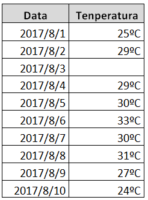

<p align="center">

</p>

# R-ko balio bereziak

`R` programazio-lengoaia hainbat ***balio nulu*** ezberdinekin lan egiteko gai da. ***Balio nulu*** horietako bakoitzak, bere ezaugarri propioak ditu eta garrantzitsua da ondo ulertzea. Hurrengoak ikusiko dira koaderno honetan:

 - `NA`
 - `Inf` / `-Inf`
 - `NaN`
 - `NULL` 

## `NA` balioak

`NA` balioak, *Not Available* adierazteko erabiltzen da, hau da, ez dagoela erabilgarri adierazteko. Balio horiek, hutsuneen lekuetan agertzen dira batik bat. Demagun adibidez hurrengo taula dugula:

<p align="center">

</p>

Ikus daitekeen bezala, *2017-08-03* egunerako ez da inongo daturik agertzen, beraz datu taula hori `R`-ra pasatzerakoan, `R`-k `NA` balioa esleituko dio hutsune horri. `NA` balioekin kontu handiz ibili behar da, funtzioen jokaera alda baitezakete. Lehenengo gaian aztertzen den bezala, `sum` funtzioak bektoreko elementuen batura egiten du. Hala ere, bektorean `NA` balioak baldin badaude, `NA` itzuliko du. 


```{r}
sum(c(1,2,NA))
```

Kasu honetan, erraz konpondu daiteke arazoa, `sum` funtzioak `na.rm` atala duelako (*NA remove*). `na.rm` zatian `TRUE` jarri ezkero, `NA` balioak kontuan izan gabe egingo du batuketa.


```{r}
sum(c(1,2,4,5,10,NA))
```


```{r}
sum(c(1,2,4,5,10,NA), na.rm = TRUE)
```

Hala ere, funtzio guztiek ez dute konponbide berdina eta ondorioz kasu bakoitzean era ezberdin batean konpondu beharko da: `NA` balioak kenduz, balioak inputatuz...

## `Inf` / `-Inf` balioak

Balio hauek, infinitu ($\pm\infty$) adierazteko erabiltzen dira. Zenbaki ez-nulu bat 0-rekin zatitzen baldin badugu adibidez, `R`-k `Inf` balioa itzuliko du.


```{r}
1 / 0
```


```{r}
-1 / 0
```

Bestalde, ordenagailuen memoria finitua denez, `R`-n mugak jartzen dira zenbakiekin. `R`-ko 3.5.0 bertsioan adibidez erabil daitezkeen zenbakiak hurrengo tartean egon behar dira:

\begin{equation}
    [-10^{308},+10^{308}]
\end{equation}

eta tarte horretatik kanpo dauden zenbakiak $\pm\infty$ kontsideratzen dira,


```{r}
1e+308

1e+309
```


```{r}
-1e+308

-1e+309
```

## `NaN` balioak

Ingelesezko esanahaia, *Not a Number*, hau da, ez dela zenbakizkoa. Kasu gehienetan indeterminazio matematikoa adierazteko erabiltzen da, adibidez:
 - $\infty - \infty$
 - $\dfrac{0}{0}$
 - $0\cdot\infty$
 - ...


```{r}
Inf - Inf

0 / 0

0 * Inf
```

Hala ere, `R`-k ez ditu indeterminazio matematiko guztiak horrela tratatzen:
$$1^\infty$$
$$0^0$$


```{r}
1 ^ Inf

0 ^ 0
```
