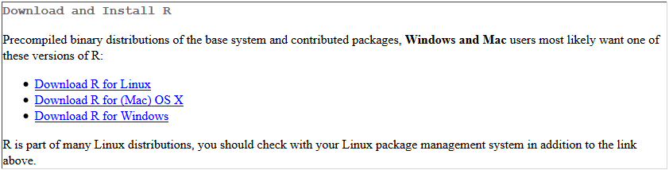
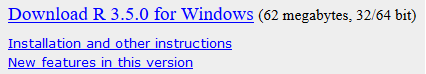
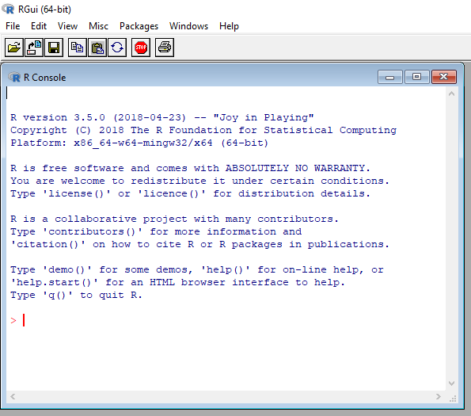

# R-Ikasten

Hona igotako fitxategien helburua [R](http://www.cran.r-project.org/) programazio-lengoaiaren lehen pausuak euskeraz irakastea da ahalik eta era errazenean. Horretarako, [Jupyter](http://jupyter.org/)-eko eta [R-ko Notebook](https://rmarkdown.rstudio.com/r_notebooks.html)-ak edo koadernoak erabiliko dira era erakargarriago batetan irakasteko asmoarekin.

Erabiltzailearen lehen programazio-lengoaia baldin bada, [Jupyter](http://jupyter.org/) erabiltzea **GOMENDATZEN** da, instalatzeko zailagoa izan daitekeen arren, kodea eta testua era erakargarriago eta ulerterrazagoan ikusten delako. Hala ere, nahi izanezkero [RStudio](https://www.rstudio.com/) bidez ere jarrai daiteke [R](http://www.cran.r-project.org/)-ko sarrera hau.

Kurtso hau jarraitzeko, bi aukera daude:
 - [R](http://www.cran.r-project.org/), [Jupyter](http://jupyter.org/) eta [IRkernel](https://irkernel.github.io/) instalatzea
 
edo
 - [R](http://www.cran.r-project.org/) eta [RStudio](https://www.rstudio.com/) instalatzea

## R instalatzen

[R](http://www.cran.r-project.org/) instalatzeko, klikatu hurrengo [link](https://cran.r-project.org/) honetan. Bertan, gure sistema eragilea aukeratu beharko dugu.

Windows sistema eragilea baldin baduzu eta [R](http://www.cran.r-project.org/) lengoaian berria baldin bazara, egin klik hurrengo link horretan eta ondoren `Download R x.x.x for Windows`

  

  

## Jupyter instalatzen

[Jupyter](http://jupyter.org/) erabiltzeko [Python](https://www.python.org/) programazio-lengoaia ere instalatuta izan behar dugu. Horretarako, era errazena [Anaconda](https://www.anaconda.com/download/) instalatzea da, bertan [Jupyter](http://jupyter.org/) eta [Python](https://www.python.org/) instalatzen direlako aldi berean eta automatikoki. Hala ere, nahi izanez gero [Jupyter](http://jupyter.org/) era zuzenagoan instalatu dezakegu beraien orrialdean adierazten den bezala, nahiz eta konplexuagoa den eta ez den beraien garatzaileen gomendioa. 

## IRkernel instalatzen

Behin [R](http://www.cran.r-project.org/) eta [Jupyter](http://jupyter.org/) instalatuta baldin baditugu, [IRkernel](https://irkernel.github.io/) instalatzeko prest gaude. Hasteko, [R](http://www.cran.r-project.org/) programa irekiko dugu

  

eta [IRkernel](https://irkernel.github.io/)-en web orrian adierazten den bezala ( [link](https://irkernel.github.io/installation/) ), hurrengo idatziko dugu:

`install.packages(c('repr', 'IRdisplay', 'evaluate', 'crayon', 'pbdZMQ', 'devtools', 'uuid', 'digest'))`

`devtools::install_github('IRkernel/IRkernel')`

`IRkernel::installspec()`
