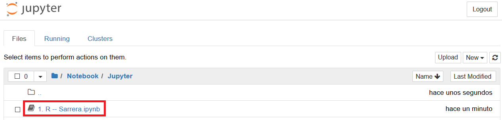

# R-Ikasten

Hona igotako fitxategien helburua [R](http://www.cran.r-project.org/) programazio-lengoaiaren lehen pausuak euskeraz irakastea da ahalik eta era errazenean. Horretarako, [Jupyter](http://jupyter.org/)-eko eta [R-ko Notebook](https://rmarkdown.rstudio.com/r_notebooks.html)-ak edo koadernoak erabiliko dira era erakargarriago batetan irakasteko asmoarekin.

Kurtsoa bi modutan jarrai daiteke: internet bidez ([Binder](https://mybinder.org/) bidez) edo programak lokalki instalatuz.

## Internet bidez

Era azkarrena eta errazena [Binder](https://mybinder.org/) erabiltzea da. Horretarako, dokumentu honen hasieran dagoen hurrengo ikonoan klikatu beharko dugu:

  

[Binder](https://mybinder.org/)-en kontrapuntuak ordea honako hauek dira besteak beste:
 - Momentuz Beta egoeran dago (erroreak izan ditzake).
 - Interneterako konexioa behar dugu.
 - Exekuzio denborak luzeagoak izan daitezke (Hasiera batetan ez da garrantzitsua izango, baina tamainu handiko datuekin arazo bat izan daiteke).
 - Notebook-etan egiten ditugun aldaketak eta ariketak ez dira gordeko interneten (nahiz eta gure ordenagailuan gordetzeko aukera emango digun).
 
Bide hau hartzen baldin badugu, lehenengo Notebook-a hurrengo helbidean aurki dezakegu eta [R](http://www.cran.r-project.org/) ikasten has gaitezke zuzenean:
 

  

 
 
## R gure ordenagailuan instalatuz

Erabiltzailearen lehen programazio-lengoaia baldin bada, [Jupyter](http://jupyter.org/) erabiltzea **GOMENDATZEN** da, instalatzeko zailagoa izan daitekeen arren, kodea eta testua era erakargarriago eta ulerterrazagoan ikusten delako. Hala ere, nahi izanezkero [RStudio](https://www.rstudio.com/) bidez ere jarrai daiteke [R](http://www.cran.r-project.org/)-ko sarrera hau.

Kurtso hau lokalki jarraitzeko asmoa duenarentzko (programak ordenagailuan instalatuz), bi aukera daude:
 - [R](http://www.cran.r-project.org/), [Jupyter](http://jupyter.org/) eta [IRkernel](https://irkernel.github.io/) instalatzea
 
edo
 - [R](http://www.cran.r-project.org/) eta [RStudio](https://www.rstudio.com/) instalatzea

### R instalatzen

[R](http://www.cran.r-project.org/) instalatzeko, klikatu hurrengo [link](https://cran.r-project.org/) honetan. Bertan, gure sistema eragilea aukeratu beharko dugu.

Windows sistema eragilea baldin baduzu eta [R](http://www.cran.r-project.org/) lengoaian berria baldin bazara, egin klik hurrengo link horretan eta ondoren `Download R x.x.x for Windows`

  

  

### Jupyter instalatzen

[Jupyter](http://jupyter.org/) erabiltzeko [Python](https://www.python.org/) programazio-lengoaia ere instalatuta izan behar dugu. Horretarako, era errazena [Anaconda](https://www.anaconda.com/download/) instalatzea da, bertan [Jupyter](http://jupyter.org/) eta [Python](https://www.python.org/) instalatzen direlako aldi berean eta automatikoki. Hala ere, nahi izanez gero [Jupyter](http://jupyter.org/) era zuzenagoan instalatu dezakegu beraien orrialdean adierazten den bezala, nahiz eta konplexuagoa den eta ez den garatzaileen gomendioa (alde ona, instalazio optimoagoa dela da, memoria gutxiago behar duena). 

### IRkernel instalatzen

Behin [R](http://www.cran.r-project.org/) eta [Jupyter](http://jupyter.org/) instalatuta baldin baditugu, [IRkernel](https://irkernel.github.io/) instalatzeko prest gaude. Hasteko, [R](http://www.cran.r-project.org/) programa irekiko dugu

  

eta [IRkernel](https://irkernel.github.io/)-en web orrian adierazten den bezala ([link](https://irkernel.github.io/installation/)), hurrengoa idatziko dugu [R](http://www.cran.r-project.org/)-ko kontsolan:

`install.packages(c('repr', 'IRdisplay', 'evaluate', 'crayon', 'pbdZMQ', 'devtools', 'uuid', 'digest'))`

`devtools::install_github('IRkernel/IRkernel')`

`IRkernel::installspec()`

3 kode lerro horiek exekutatzearekin [Jupyter](http://jupyter.org/) erabiltzeko prest egon beharko luke.

### RStudio instalatzen

Aurrerago esan bezala, kurtso hau [Jupyter](http://jupyter.org/) instalatu gabe ere jarrai daiteke, nahiz eta ez den gomendagarriena, kurtsoa ez dagoelako horrela bideratuta. Hala ere, [Jupyter](http://jupyter.org/) instalatzea nahi ez duen erabiltzailearentzako, [RStudio](https://www.rstudio.com/) instalatzea gomendatzen da, [link](https://www.rstudio.com/products/rstudio/download/) honen bidez. 
